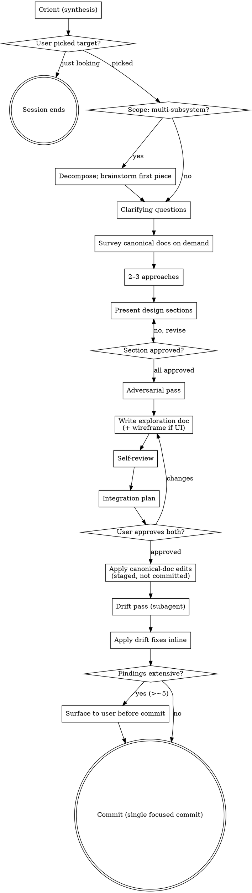

# Architectural design — Aventuras

Help turn architectural ideas into fully-formed designs through dialogue, ending with a written spec that's been adversarially reviewed and integrated into the project's canonical docs.

This is for **analysis and design work**, not implementation. The output is documentation — markdown specs, decision records, trade-off tables, canonical-doc updates (`architecture.md` / `data-model.md` / `ui/` / `followups.md`), and colocated HTML wireframes for UI surfaces. No app or runtime code is touched.

The skill opens with an **orient** that surfaces recent activity, open followups, the user's scratchpad, and proposed focus candidates — then waits for the user to pick a target. Once a target is chosen, the design workflow runs (scope check → clarifying questions → approaches → sectioned design → adversarial pass → spec → integration). If the user only wanted to look around, the session ends cleanly after orient.

<HARD-GATE>
Do NOT modify canonical docs (`architecture.md`, `data-model.md`, `calendar-systems.md`, `ui/**`) until (1) a written design exists, (2) it has been through adversarial analysis, (3) the user has approved both the design and the integration plan. Drafting under `docs/explorations/` during the session is fine; touching canonical docs is the gated step. After approval, integration applies edits → runs the **Drift pass** subagent against the staged diff → applies any drift fixes → commits. No second user confirmation between approval and commit.
</HARD-GATE>

## Anti-pattern: "this is too small for a design"

Schema tweaks, single-field additions, "small" pipeline changes — these are where unexamined assumptions cause the most thrash. The design can be short — a few paragraphs for genuinely small changes — but it MUST be written down and approved before canonical docs change.

## Checklist

Track as tasks; complete in order:

1. **Orient.** Run reads in parallel: `docs/README.md`, `docs/ui/README.md`, `docs/ui/patterns/README.md`, `docs/followups.md`, `docs/user-notes.local.md` (if it exists), `git log --oneline -10`, `git status`. Do NOT read large content docs (`architecture.md`, `data-model.md`, `calendar-systems.md`, per-screen) at this stage. Produce the structured synthesis (see _Orient — synthesis format_ below) and wait for the user to pick a target.
2. **Scope check.** Once the user picks a target: if it spans multiple independent subsystems, surface that and decompose first.
3. **Clarifying questions** — one at a time. Probe purpose, constraints, success criteria, what fails today.
4. **Survey on demand.** Read the relevant canonical docs only when scope is clear (`data-model.md` for schema, `architecture.md` for pipeline, the relevant per-screen doc for UI).
5. **2–3 approaches** with trade-offs and a recommendation.
6. **Present design sections.** One section at a time, approval per section.
7. **Adversarial pass.** Once it "feels right", deliberately try to break it.
8. **Write design doc** to `docs/explorations/YYYY-MM-DD-<topic>.md` (default; user may redirect). For UI surfaces, draft the wireframe at `docs/ui/screens/<screen>/<screen>.html` alongside.
9. **Self-review** — placeholders, consistency, scope, ambiguity, doc rules. Fix inline.
10. **Integration plan** — exact files / sections / followups / wireframes affected.
11. **User reviews doc + plan.**
12. **Apply canonical-doc edits + wireframe changes.** Stage them with `git add` but do NOT commit yet.
13. **Drift pass** (subagent). Hand a fresh subagent the staged diff, the integration plan, and the four drift checks (rename impact / pattern adoption / followups in-out / boilerplate detection — see _Drift pass_ below). Subagent reports findings; orchestrator interprets and applies fixes inline. If findings are extensive (>~5 non-trivial), surface to the user before commit.
14. **Commit.** Single focused commit including drift-pass fixes. `pnpm lint:docs` already ran via the pre-commit hook.

## Process



**Terminal state is canonical-doc integration.** No implementation skill follows — the design IS the deliverable; the canonical docs ARE the spec.

## Orient — synthesis format

After the orient reads, send one focused message containing:

1. **Recent activity** — one or two lines summarizing what landed in the last few commits. The user already knows; this confirms shared context.
2. **Open followups by domain** — grouped count + items closest to actionable. Don't dump full text; titles + a short hint per item. Example shape:
   > Data-model (5): `entities.state` shape, manual worldTime correction, top-K salience long-term memory, fictional calendars, non-linear narrative.
   >
   > UX (12): immutable settings, rollback confirmation, lead switch on peek, …
3. **User-notes scratchpad** — if `user-notes.local.md` has content, surface it verbatim (the user wrote it for themselves; it's the strongest hint about session intent). If empty or absent, say so explicitly.
4. **Proposed focus candidates** — 1–3 specific things from the above that look like good targets, with brief reasoning. Lean on what's hot in scratchpad + recent commits.
5. **Ask what we're tackling.** End with a question. Don't proceed past orient until the user confirms direction. If they say "just looking" or similar, the session ends here.

## Understanding the idea

- Don't pre-read large content docs at orient. Load on demand once focus is clear.
- Decompose multi-subsystem requests before refining details. "Add non-linear narrative across reader, composer, branch nav, and rollback" is four designs masquerading as one. Surface that first.
- One question per message. Multiple-choice when both work.
- Probe purpose / constraints / success / what fails today. "What fails today" is where assumptions hide.

## Approaches

- 2–3 options, trade-offs, recommendation, reasoning.
- Lead with the recommendation; make rejected options feel real, not strawmen.
- Data-model work: cost at every read site. Pipeline work: retry, caching, retrieval-staleness invariants. UI work: which existing principles / patterns it ties to.

## Presenting the design

- Scale each section to complexity. Sentences for small; up to ~300 words for nuanced.
- Approval per section before moving on.
- Cover as relevant: domain shape (schema / state), pipeline / data flow, error and edge cases, UX surface impact, doc-integration impact, follow-ups generated.

## Adversarial pass

The user has been explicit: "feels right" is a failure mode. Once the design has section-by-section approval, deliberately try to break it. Run through:

- **Load-bearing assumption.** What single assumption, if wrong, collapses the design? Name it.
- **Edge cases.** What input or state breaks the invariant? (Empty story, branch with no entries, entity referenced from a deleted lore, manual worldTime correction mid-generation, awareness link to an entity that hasn't been encountered yet.)
- **Read-site impact.** Every read site touching the changed shape — each one updated, or did some get hand-waved?
- **Doc-integration cascades.** Does this rename a heading anchor referenced from elsewhere? Invalidate a wireframe? Create a follow-up that should land in `followups.md`?
- **Missing perspective.** What didn't get asked — implementation cost, cross-platform implication, sync/backup format, undo / rollback semantics, translation behavior?

State what you found, even if "nothing — and here's why I'm confident." Distinguish what you verified from what you assumed.

## Writing the design

- Default path `docs/explorations/YYYY-MM-DD-<topic>.md`. User may redirect or integrate directly into a canonical doc.
- Prose first; tables and code blocks only when they earn space.
- Anchor-link to canonical docs (`[the schema](../data-model.md#entities)`).
- Doc rules in `.claude/rules/docs.md` apply: anchor discipline, no bracketed inline phrases without backticks, README-as-index.

## Self-review

Fresh-eyes pass after writing:

1. **Placeholders** — any TBD / TODO / vague "we should consider"? Fix.
2. **Internal consistency** — sections agreeing? Schema description matches example?
3. **Scope** — still single-integration? If not, split.
4. **Ambiguity** — any requirement readable two ways? Pick one.
5. **Doc rules** — anchor links resolve? No accidental reference-style brackets in prose?

Fix inline. No need to re-review — fix and move on.

## Integration plan

Draft before requesting review. The plan doubles as the input brief for the drift-pass subagent — every item below has a corresponding drift check, so the more explicit the plan, the cleaner the drift report.

- **Which canonical files change.** For each, which section / anchor.
- **Renames** — every heading or schema field name being renamed, with old → new mapping. (Drift check 1 grep-sweeps inbound refs.)
- **Patterns adopted on a new surface** — list the `(per-screen doc, pattern.md)` pairs where this surface is citing a pattern it hasn't cited before. (Drift check 2 verifies the pattern's Used-by got updated.)
- **Followups resolved** — list followup entries this integration closes, with `followups.md` anchors. (Drift check 3 confirms removal.)
- **Followups introduced** — list new deferrals + where the new entry lands in `followups.md`. (Drift check 3 confirms addition.)
- **Wireframes updated** — paths + which states / behaviors changed.
- **Intentional repeated prose** — if the integration writes prose into a per-screen doc that's near-identical to existing prose elsewhere on purpose (e.g., a deliberate local restatement for context), call it out so drift check 4 doesn't churn on it.

## User review gate

> "Design written to `<path>`, integration plan above. Please review both before I touch the canonical docs."

Wait. If changes requested, revise and re-self-review. Only proceed once both doc AND integration plan are approved. After approval, the flow runs apply → drift pass → fix-if-needed → commit without a second confirmation, **unless** the drift pass surfaces extensive findings — in which case the orchestrator pauses and shows the findings before committing.

## Integrating

- Apply canonical-doc changes and stage with `git add` — do NOT commit yet. The drift pass runs against the staged diff before the commit fires.
- `git mv` for any reorganization. Update inbound anchor / path references in the same commit.
- Update `followups.md` (resolved or new) in the same commit.
- Exploration doc: kept as a record or removed once integrated — user's call (ask once, then act).
- Project commit style: concise subject, narrative body with the resolution.
- The pre-commit hook runs `prettier` + `remark` automatically; no need to run `pnpm lint:docs` manually before staging.

## Drift pass

After canonical-doc edits are staged but before the commit fires, dispatch a **fresh subagent** to check the staged diff against the integration plan. Session context biases toward "I thought really hard, this is right" — the audit-fix work that prompted this stage found exactly the kind of drift the original session writers didn't see. Fresh eyes with deterministic checks catch the common cases.

### Why a subagent

- **No session bias.** The orchestrator's context includes hours of "this is the right design" — that lens makes drift invisible. A subagent sees only the diff + the plan + the rules to check against.
- **Forced explicitness.** Briefing the subagent forces the orchestrator to articulate exactly what was supposed to happen.
- **Fresh prompt budget.** The orchestrator has consumed context discussing the design; the subagent gets a clean window for focused checks.

### Subagent invocation

Use the `general-purpose` subagent type (no specialized agent needed). Brief it with:

- The staged diff: `git diff --staged` (or work-tree diff if not yet staged).
- The integration plan from this design session (verbatim — names files / sections / followups it intended to touch).
- The four drift checks below, each with a "report drift if X" rule.

Tell it explicitly: **"Report drift findings only. Do not re-evaluate the design itself. Do not propose alternative approaches. The design is locked; you're checking that what got written matches what was planned + standing project rules."**

### The four checks

1. **Rename impact.** If the diff renames any heading (`## X` → `## Y`) or schema field name (TS comment, ER diagram, prose mention), grep the rest of the repo for inbound refs to the old name. Report any inbound ref the diff didn't sweep. Special attention to:
   - Anchor links `[label](./file.md#old-slug)` — lint catches the broken anchor but not stale labels.
   - Prose mentions of the old name in per-screen docs.
   - Cross-doc references in `principles.md` / `patterns/*.md`.

2. **Pattern adoption.** If the diff adds a citation like `[xxx pattern](../../patterns/<pattern>.md)` from a per-screen doc that wasn't already in that pattern's `Used by` list, report. The pattern doc's Used-by list is the canonical surface→pattern map; a new adoption that doesn't update it leaves the pattern stale.

3. **Followups in / out.** Two questions:
   - **Resolved any parked decision?** Grep `followups.md` for keywords matching changed canonical content (field names, feature names from the integration plan). If a followup entry references something the diff just resolved, report — entry should be removed.
   - **Deferred anything new?** If the diff prose contains "deferred", "TBD", "pending design pass", or similar, AND the diff doesn't add a `followups.md` entry covering it, report — the deferral should be parked.

4. **Boilerplate detection.** If the diff writes prose into a per-screen doc that closely matches prose already in another per-screen doc, report. Heuristic: 2+ matching sentences = candidate; 4+ = strong signal. Cross-cutting prose belongs in `principles.md` or `patterns/`, not duplicated. (Soft check — orchestrator weighs surface-specific deviations against generic boilerplate.)

### Output shape

Subagent returns structured findings, one per check:

```
### Rename impact
[no drift] OR [drift: <file>:<line> still references old name `X`; planned rename to `Y` in <other file>]

### Pattern adoption
[no drift] OR [drift: <surface doc> cites <pattern>, but <pattern>.md → Used by doesn't list <surface>]

### Followups in/out
[no drift] OR [drift: <followup entry name> appears resolved by this integration but the followup wasn't removed]
[no drift] OR [drift: integration prose defers <topic> but no followup entry was added]

### Boilerplate detection
[no drift] OR [drift: <surface A>:<lines> and <surface B>:<lines> contain near-identical prose about <topic>; consider promoting]
```

### What the orchestrator does with findings

- **No drift across all four checks** → proceed to commit. Drift pass took 30-60s; cost is acceptable as standing tax.
- **Drift found, mechanical fixes only** (rename ref to update, Used-by entry to add, followup to remove/add) → apply inline, re-stage, commit.
- **Drift found, judgment call needed** (boilerplate detection often surfaces things that are intentionally local) → surface to user with the subagent's evidence; user decides whether to fix or note as intentional.
- **Findings extensive** (~5+ non-trivial) → don't auto-fix. Surface the full list to the user; redesign-or-revise might be warranted.

The subagent never commits. Only the orchestrator commits, after fixes are applied.

## Visual artifacts

The project has native visual formats; use them directly rather than inventing parallel infrastructure.

- **UI surfaces** → colocated HTML wireframe at `docs/ui/screens/<screen>/<screen>.html`. If the design covers a UI surface, draft the wireframe alongside the doc (or update an existing wireframe) and include it in the integration plan. Use existing wireframes as templates — review-controls bar, monochrome styling, vanilla JS, no build.
- **Schema relationships, pipeline sequences, state machines** → mermaid or ASCII directly inside the markdown. Inline beats out-of-band.
- **Trade-off comparisons, A/B/C options, conceptual choices** → text. Tables in markdown, no diagram needed.

A UI topic isn't automatically a visual question. "What does 'lead character' mean in a peek?" is conceptual — answer in text. "Which peek-affordance layout works better?" is visual — sketch alternatives in a wireframe.

## Key principles

- **One question at a time.**
- **Multiple-choice when feasible.**
- **YAGNI ruthlessly.** Strip features the user didn't ask for.
- **2–3 approaches before settling.**
- **Section-by-section approval.**
- **Adversarial pass is non-optional.** "Feels right" doesn't ship.
- **Drift pass is non-optional.** Subagent runs on the staged diff before every commit. The orchestrator's session context is the wrong lens for catching consistency drift — fresh eyes find what the writer can't see.
- **Canonical docs are gated.** Touch them only after approval; drift pass runs between apply and commit.
- **Verified vs. assumed.** Never let an assumption ride as a conclusion.
- **Be flexible.** Go back when something doesn't fit.

## What this skill does NOT do

- Does not write app or runtime code (nothing under `app/`, `electron/`, `components/`, `lib/`, `hooks/`). Output is documentation only: markdown specs and canonical updates, plus HTML wireframes under `docs/ui/screens/`.
- Does not transition to an implementation skill — canonical docs are the spec.
- Does not pre-read large content docs at orient. Loads them on demand once a target is picked.
- Does not modify canonical docs before approval. Stays in `docs/explorations/` until sign-off.
- Does not duplicate the docs working rules. Trust `.claude/rules/docs.md` to auto-load on `docs/**` reads.
- Does not run `pnpm lint:docs` proactively. Only after canonical edits exist to validate.
- Does not ask for a second confirmation before committing once the design + integration plan have been approved.
